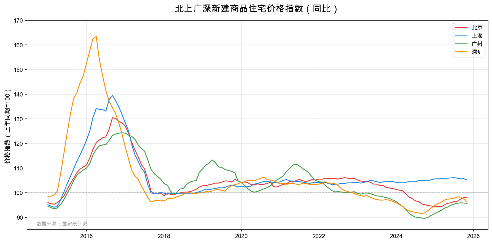

# 70城房价数据 | China 70-City House Price Index

[]()
[]()
[]()
[](./LICENSE)

🏠 中国国家统计局官方发布的70个大中城市商品住宅销售价格变动数据集，含自动化更新与数据提取工具。

## ✨ 特点

- 📊 **完整历史数据**：2006年至今近20年的月度数据（约4.5万条记录）
- 🔄 **自动化更新**：一行命令即可更新最新月份数据
- 🔍 **灵活提取**：支持按城市、按时间范围等多种方式提取子数据集
- 📦 **即用即走**：CSV格式，无需数据库，可直接用于 Python/R/Excel 分析

## 💡 使用场景

- 房地产市场研究与趋势分析
- 城市间房价比较研究
- 宏观经济政策效果评估
- 数据新闻与可视化项目
- 学术论文数据支持

## 📈 数据预览



<details>
<summary>点击展开数据样例</summary>

| DATE | CITY | FixedBase | CommodityHouseIDX | SecondHandIDX |
|------|------|-----------|-------------------|---------------|
| 2025/11/1 | 北京市 | 同比 | 97.9 | 93.2 |
| 2025/11/1 | 上海市 | 同比 | 105.1 | 95.4 |
| 2025/11/1 | 广州市 | 同比 | 95.7 | 92.8 |
| 2025/11/1 | 深圳市 | 同比 | 96.3 | 95.2 |

</details>

---

## 📁 目录结构

```
70cityprice/
├── 70cityprice.csv         # 主数据文件（2006年至今，当前更新至2025年11月）
├── README.md               # 项目说明文档
├── LICENSE                 # CC BY 4.0 许可证
├── assets/                 # 资源文件
│   └── price_trend.png     # 数据可视化图表
├── tools/                  # 工具脚本目录
│   ├── extract_70cityprice.py   # 数据提取脚本
│   ├── update_70cityprice.py    # 数据更新脚本
│   └── generate_chart.py        # 图表生成脚本
└── projects/               # 生成的数据文件（Git忽略，不上传）
```

| 文件/目录 | 说明 |
|-----------|------|
| `70cityprice.csv` | 主数据文件，包含2006年至今的完整历史数据 |
| `tools/update_70cityprice.py` | **自动更新脚本** - 从国家统计局网址抓取新数据并追加到CSV |
| `tools/extract_70cityprice.py` | **数据提取脚本** - 按月份/城市提取数据到新文件 |
| `projects/` | 本地生成的数据文件目录（Git忽略） |

## 🚀 快速使用

### 更新数据

每月国家统计局发布新数据后，只需运行：

```bash
python tools/update_70cityprice.py "国家统计局发布页面的URL"
```

**示例：**
```bash
# 更新6月份数据（7月发布）
python tools/update_70cityprice.py "https://www.stats.gov.cn/sj/zxfbhjd/202507/t20250715_1960403.html"

# 更新1月份数据（2月发布）- 脚本会自动处理没有年度平均的情况
python tools/update_70cityprice.py "https://www.stats.gov.cn/xxgk/sjfb/zxfb2020/202502/t20250219_1958761.html"
```

脚本会自动：
1. 从URL抓取所有表格数据
2. 解析日期（会自动计算上一个月作为数据月份）
3. 提取70个城市的所有指数
4. **自动检测表格列数**，适配不同月份的表格格式
5. **1月份特殊处理**：由于1月份没有"年度平均"列，脚本会自动使用同比数据作为定基比
6. 追加到现有CSV文件中（如果该月数据已存在则替换）

### 提取数据

#### 按月份提取

```bash
python tools/extract_70cityprice.py month <起始月份> <结束月份> [输出文件名]
```

**示例：**
```bash
# 提取2025年7月至11月的数据（自动保存到 projects/ 目录）
python tools/extract_70cityprice.py month 202507 202511

# 指定输出文件名
python tools/extract_70cityprice.py month 202507 202511 my_data.csv

# 支持多种日期格式
python tools/extract_70cityprice.py month 2024-01 2024-12
```

#### 按城市提取

```bash
python tools/extract_70cityprice.py city <城市名1> [城市名2] ... [--output 输出文件名]
```

**示例：**
```bash
# 提取单个城市的全部历史数据
python tools/extract_70cityprice.py city 成都市

# 提取多个城市
python tools/extract_70cityprice.py city 北京市 上海市 广州市 深圳市

# 指定输出文件名
python tools/extract_70cityprice.py city 成都市 --output chengdu.csv
```

#### 组合过滤（城市+月份）

```bash
python tools/extract_70cityprice.py filter --cities <城市1> <城市2> ... --start <起始月份> --end <结束月份>
```

**示例：**
```bash
# 提取成都和重庆2024年全年数据
python tools/extract_70cityprice.py filter --cities 成都市 重庆市 --start 202401 --end 202412
```

#### 辅助命令

```bash
# 列出所有可用城市
python tools/extract_70cityprice.py list-cities

# 列出数据日期范围
python tools/extract_70cityprice.py list-dates
```

### 输出文件位置

| 情况 | 输出位置 |
|------|----------|
| 不指定 `--output` | 自动保存到 `projects/` 目录 |
| 指定文件名 `--output my.csv` | 保存到 `projects/my.csv` |
| 指定路径 `--output data/my.csv` | 保存到指定路径 |

> 💡 `projects/` 目录已在 `.gitignore` 中配置忽略，生成的数据文件不会上传到 GitHub。

### ⚠️ 1月份数据说明

每年1月份的数据发布时，表格结构与其他月份不同：
- **其他月份**：包含 环比、同比、年度平均（1-N月平均）三列
- **1月份**：只有 环比、同比 两列（因为1月是第一个月，没有累计平均）

脚本会自动检测这种情况，并将 **同比数据复制到定基比** 字段中。

## 📋 数据结构

### CSV文件列说明

| 列名 | 说明 | 示例 |
|------|------|------|
| DATE | 数据日期 | 2025/10/1 |
| ADCODE | 城市行政区划代码 | 110100 |
| CITY | 城市名称 | 北京市 |
| FixedBase | 指数类型 | 同比/环比/定基比 |
| HouseIDX | 住宅价格指数（早期数据） | |
| ResidentIDX | 住宅价格指数（早期数据） | |
| CommodityHouseIDX | 新建商品住宅指数 | 99.7 |
| SecondHandIDX | 二手住宅指数 | 99.0 |
| ResidentBelow90IDX | 住宅90m²以下（早期数据） | |
| CommonResidentBelow90IDX | 普通住宅90m²以下（早期数据） | |
| CommodityBelow90IDX | 新建商品住宅90m²以下 | 99.5 |
| Commodity144IDX | 新建商品住宅90-144m² | 99.6 |
| CommodityAbove144IDX | 新建商品住宅144m²以上 | 99.9 |
| SecondHandBelow90IDX | 二手住宅90m²以下 | 98.8 |
| SecondHand144IDX | 二手住宅90-144m² | 99.3 |
| SecondHandAbove144IDX | 二手住宅144m²以上 | 99.1 |

### 指数类型说明

| 类型 | 说明 | 计算基期 |
|------|------|----------|
| 同比 | 与上年同月相比 | 上年同月=100 |
| 环比 | 与上月相比 | 上月=100 |
| 定基比 | 与基期相比/年度平均 | 基期=100 或 上年同期=100 |

## 🏙️ 城市列表

### 35个直辖市及省会城市
北京、天津、石家庄、太原、呼和浩特、沈阳、大连、长春、哈尔滨、上海、南京、杭州、宁波、合肥、福州、厦门、南昌、济南、青岛、郑州、武汉、长沙、广州、深圳、南宁、海口、重庆、成都、贵阳、昆明、西安、兰州、西宁、银川、乌鲁木齐

### 35个其他城市
唐山、秦皇岛、包头、丹东、锦州、吉林、牡丹江、无锡、徐州、扬州、温州、金华、蚌埠、安庆、泉州、九江、赣州、烟台、济宁、洛阳、平顶山、宜昌、襄阳、岳阳、常德、韶关、湛江、惠州、桂林、北海、三亚、泸州、南充、遵义、大理

## 📅 数据发布规律

国家统计局通常在每月**15-17日**发布上月的70城房价数据。

例如：
- 2025年7月15日 发布 2025年6月数据
- 2025年8月16日 发布 2025年7月数据

## ⚠️ 注意事项

1. **URL格式**：确保使用国家统计局官方发布页面的完整URL
2. **网络连接**：脚本需要访问互联网抓取数据
3. **数据覆盖**：如果该月数据已存在，脚本会替换旧数据
4. **历史数据格式**：2011年前后数据结构有变化，部分列可能为空

## 🔗 数据来源

- [国家统计局统计数据](https://www.stats.gov.cn/sj/)
- [70城房价数据发布页](https://www.stats.gov.cn/sj/zxfb/)

## 📜 许可与声明

### 数据来源

本仓库中的统计数据来源于**中华人民共和国国家统计局**，属于政府公开数据。

### 代码许可

本仓库中的工具脚本代码采用 [MIT License](./LICENSE) 开源。

### 免责声明

本仓库仅提供数据整理与工具服务，不对数据准确性负责。如需官方数据，请访问 [国家统计局网站](https://www.stats.gov.cn/)。

### 引用格式

如果您在研究或项目中使用了本数据集，建议按以下格式注明来源：

```
数据来源：国家统计局《70个大中城市商品住宅销售价格变动情况》
数据整理：70城房价数据项目 https://github.com/[your-username]/70cityprice
```

## 📝 更新日志

- **2025-12-15**: 添加数据可视化图表、优化README结构、添加MIT许可证与数据来源声明
- **2025-12-15**: 重构项目结构，工具脚本移至 `tools/` 目录，新增 `projects/` 目录存放生成数据
- **2025-12-15**: 增强数据提取脚本，支持按城市提取、组合过滤等功能
- **2025-12-15**: 新增数据提取脚本 `extract_70cityprice.py`，支持按月份范围导出数据
- **2025-12-15**: 创建自动化更新脚本 `update_70cityprice.py`，精简仓库结构
- 数据已更新至 **2025年11月**
